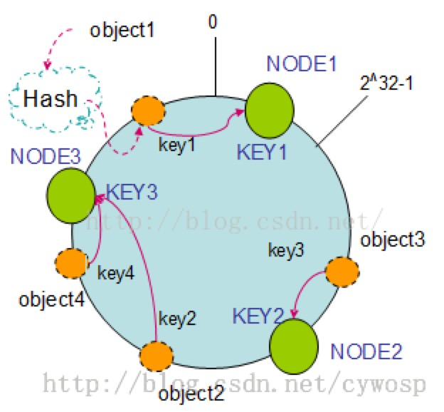

# 一致性hash算法

### 简介

key=>hash=>index

hash可以用在分布式集群上面，加入一个10个server端，一个url地址请求过来后我们可以通过hash算法映射到一台server端。这样我们就使用了hash算法

### 传统hash算法

index = hash(key) % N

传统方案我们得到了机器index值，但是我们考虑一个问题，如果某一台server端挂了，那么传统hash算法得到的index值，和之前全部不一样了。此时机器重新动态调整，导致代价异常大。

我门有3个机器，A，B，C，和三个对象O1,O2,O3。我们的需求为：ABC三台机器保存数据对象，我们可以通过hash算法拿到机器，拿到对象。

现在我们的index对应为

O1 % 3 = 1 => A

O2 % 3 = 2 => B

O3 % 3 = 3 => C

现在 B机器宕机了，此时index对应为

O1 % 2 = 1 =>A

O2 % 2 = 2 =>C

O3 % 2 = 1 =>A

因此ABC三台机器需要进行操作为：O2转移到C机器，O3转移到A机器。

我们可以明显知道O3没必要转移到A机器，直接转移O2即可，因此可以知道传统hash算法不具有高效行。

上面解释的就是hash性质：平滑性(Smoothness)

### hash算法特性

1.平衡性(Balance)

平衡性是指哈希的结果能够尽可能分布到所有的缓冲中去，这样可以使得所有的缓冲空间都得到利用。很多哈希算法都能够满足这一条件。

2.单调性(Monotonicity)

单调性是指如果已经有一些内容通过哈希分派到了相应的缓冲中，又有新的缓冲区加入到系统中，那么哈希的结果应能够保证原有已分配的内容可以被映射到新的缓冲区中去，而不会被映射到旧的缓冲集合中的其他缓冲区。简单的哈希算法往往不能满足单调性的要求，如最简单的线性哈希：x = (ax + b) mod (P)，在上式中，P表示全部缓冲的大小。不难看出，当缓冲大小发生变化时(从P1到P2)，原来所有的哈希结果均会发生变化，从而不满足单调性的要求。哈希结果的变化意味着当缓冲空间发生变化时，所有的映射关系需要在系统内全部更新。而在P2P系统内，缓冲的变化等价于Peer加入或退出系统，这一情况在P2P系统中会频繁发生，因此会带来极大计算和传输负荷。单调性就是要求哈希算法能够应对这种情况。

3.分散性(Spread)

在分布式环境中，终端有可能看不到所有的缓冲，而是只能看到其中的一部分。当终端希望通过哈希过程将内容映射到缓冲上时，由于不同终端所见的缓冲范围有可能不同，从而导致哈希的结果不一致，最终的结果是相同的内容被不同的终端映射到不同的缓冲区中。这种情况显然是应该避免的，因为它导致相同内容被存储到不同缓冲中去，降低了系统存储的效率。分散性的定义就是上述情况发生的严重程度。好的哈希算法应能够尽量避免不一致的情况发生，也就是尽量降低分散性。

4.负载(Load)
负载问题实际上是从另一个角度看待分散性问题。既然不同的终端可能将相同的内容映射到不同的缓冲区中，那么对于一个特定的缓冲区而言，也可能被不同的用户映射为不同的内容。与分散性一样，这种情况也是应当避免的，因此好的哈希算法应能够尽量降低缓冲的负荷。

5.平滑性(Smoothness)

平滑性是指缓存服务器的数目平滑改变和缓存对象的平滑改变是一致的。

### 一致性hash算法

简言之：环

将server端通过hash组成环，有四台服务端ABCD。组成环后A=>B=>C=>D=>A

数据转储到ABCD时算法为：第一台大于hash(obj)的机器上。

当插入节点时，部分节点转移。

当删除节点时部分节点转移。

### 虚拟节点一致性hash算法

虚拟节点目的：增加平衡性。带来的问题，插入删除节点时数据迁移难度增大。

物理节点变成多个虚拟节点。仍然按照上述算法。

### 应用场景

分布式缓存，集群负载均衡等